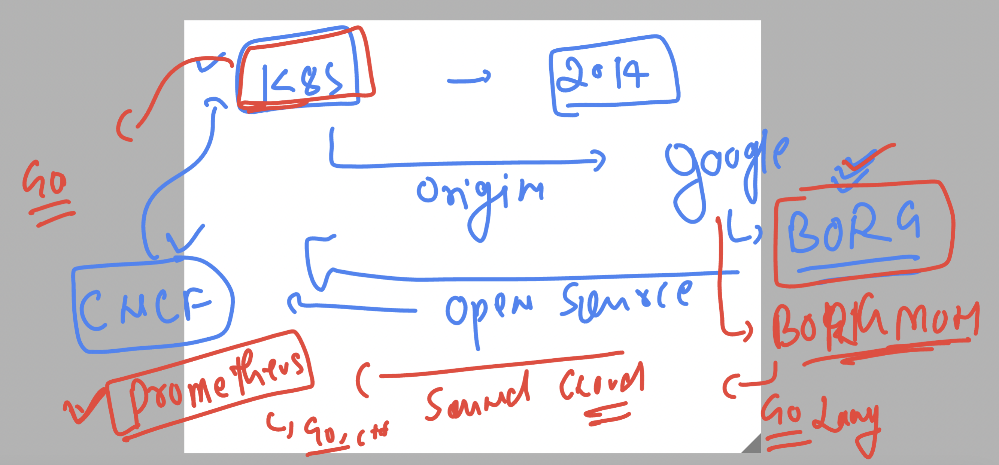
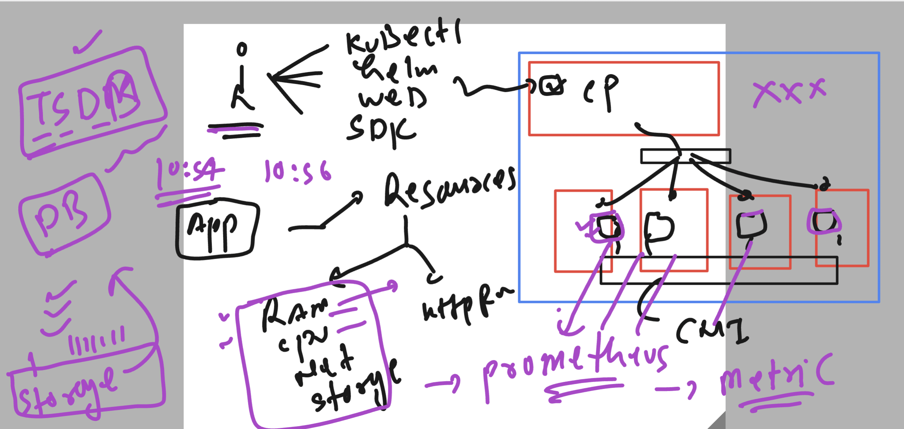
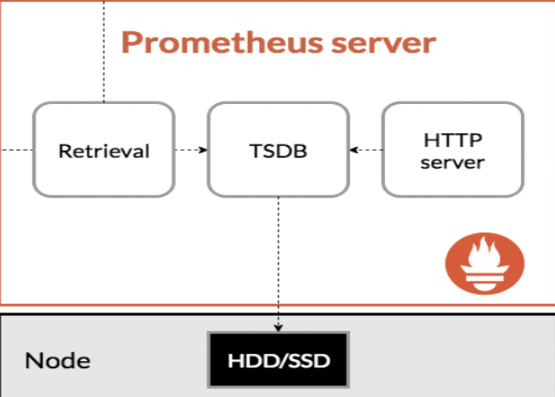
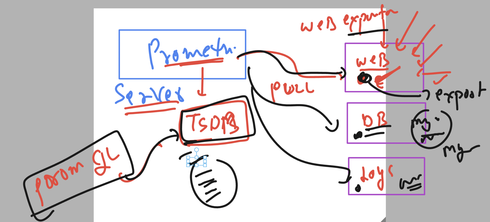
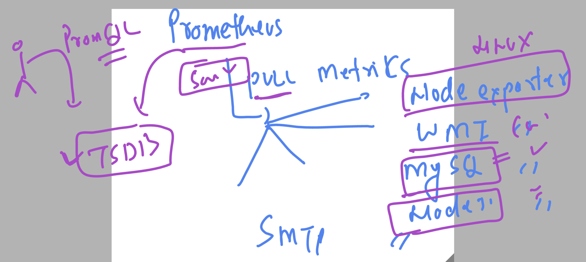
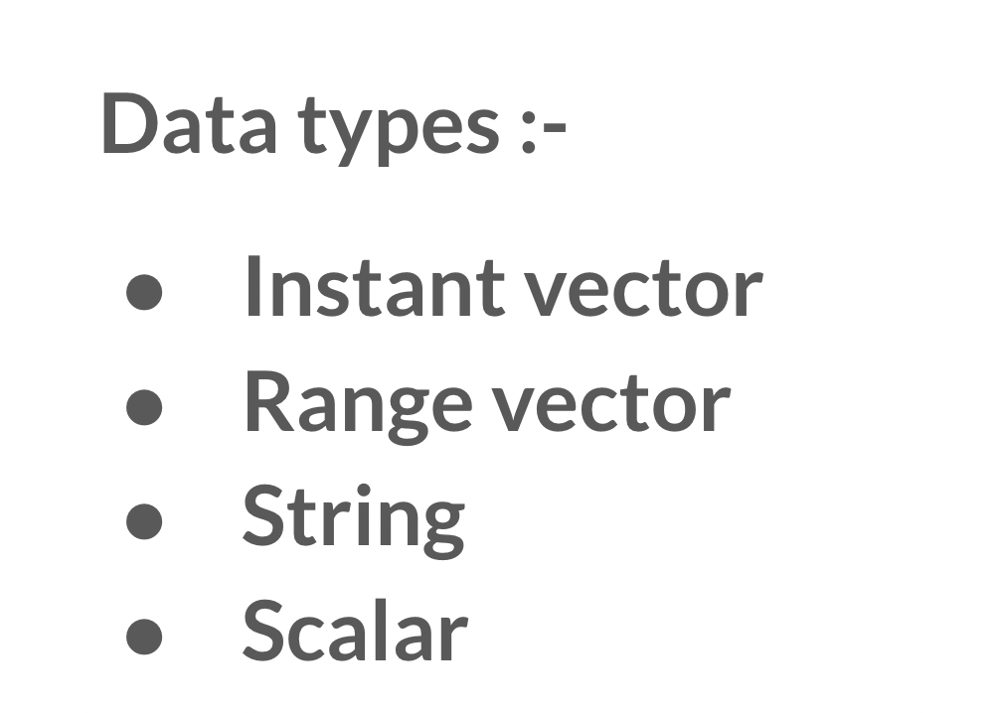
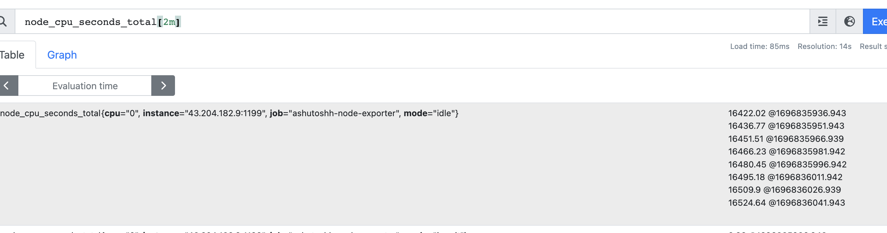

## Introduction to prometheus 



### prometheus with k8s 



### Prometheus component 



### docker-compose yaml file for prometheus server

```
version: '3'
services:
  prometheus:
    image: prom/prometheus # official docker image of promethes -- this image will be used by k8s 
    container_name: ashu-prometheus # name of container 
    ports:
      - "1234:9090"  # docker port forwarding  hostport(1024-60000):containerport (9090)
    volumes:
      - ./prometheus.yml:/etc/prometheus/prometheus.yml
      - prometheus-ashudata:/prometheus # location of TSDB 
volumes:
  prometheus-ashudata:

```

### lets deploy it 

```
[ec2-user@vodafone ashu-monitoring]$ ls
docker-compose.yaml  prometheus.yml
[ec2-user@vodafone ashu-monitoring]$ vim docker-compose.yaml 
[ec2-user@vodafone ashu-monitoring]$ vim prometheus.yml 
[ec2-user@vodafone ashu-monitoring]$ ls
docker-compose.yaml  prometheus.yml
[ec2-user@vodafone ashu-monitoring]$ docker-compose  up -d 
[+] Running 3/3
 ✔ Network ashu-monitoring_default               Created                                                                   0.0s 
 ✔ Volume "ashu-monitoring_prometheus-ashudata"  Created                                                                   0.0s 
 ✔ Container ashu-prometheus                     Started                                                                   0.0s 
[ec2-user@vodafone ashu-monitoring]$ docker-compose  ps
NAME                IMAGE               COMMAND                  SERVICE             CREATED             STATUS              PORTS
ashu-prometheus     prom/prometheus     "/bin/prometheus --c…"   prometheus          5 seconds ago       Up 4 seconds        0.0.0.0:1234->9090/tcp, :::1234->9090/tcp
[ec2-user@vodafone ashu-monitoring]$ 


```

### Understanding role of exporters to retric metrics from app /server -- pull those metrics by promethes (retrival)



### Exportes in prometheus



### adding node export in docker-compose 

```
version: '3'
services:
  node-exporter:
    image: prom/node-exporter
    container_name: ashunode1-exporter
    ports:
      - "1199:9100" # default port is 9100 i am taking 1199 as my host port 
  prometheus:
    image: prom/prometheus # official docker image of promethes -- this image will be used by k8s 
    container_name: ashu-prometheus # name of container 
    ports:
      - "1234:9090"  # docker port forwarding  hostport(1024-60000):containerport (9090)
    volumes:
      - ./prometheus.yml:/etc/prometheus/prometheus.yml
      - prometheus-ashudata:/prometheus # location of TSDB 
volumes:
  prometheus-ashudata:

```

### also adding in prometheus.yml

```
global:
  scrape_interval: 15s
scrape_configs:
  - job_name: 'prometheus'
    static_configs:
      - targets: ['43.204.182.9:1234']

  - job_name:  'ashutoshh-node-exporter'
    static_configs:
      - targets: ['43.204.182.9:1199']

```

### lets redeploy it 

```
 docker-compose  down
[ec2-user@vodafone ashu-monitoring]$ docker-compose  up -d
[+] Running 3/3
 ✔ Network ashu-monitoring_default  Created                                                                                                                  0.0s 
 ✔ Container ashu-prometheus        Started                                                                                                                  0.0s 
 ✔ Container ashunode1-exporter     Started                                                                                                                  0.0s 
[ec2-user@vodafone ashu-monitoring]$ docker-compose  ps
NAME                 IMAGE                COMMAND                  SERVICE             CREATED             STATUS              PORTS
ashu-prometheus      prom/prometheus      "/bin/prometheus --c…"   prometheus          7 seconds ago       Up 6 seconds        0.0.0.0:1234->9090/tcp, :::1234->9090/tcp
ashunode1-exporter   prom/node-exporter   "/bin/node_exporter"     node-exporter       7 seconds ago       Up 6 seconds        0.0.0.0:1199->9100/tcp, :::1199->9100/tcp
[ec2-user@vodafone ashu-monitoring]$ docker-compose  down 
```


## getting started with PromQL 

### data type in PromQL 



### range vector instance



