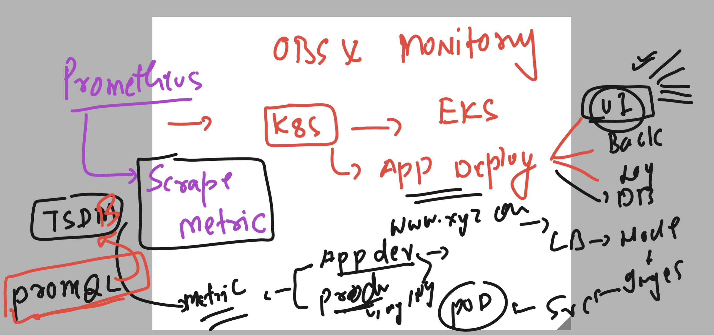
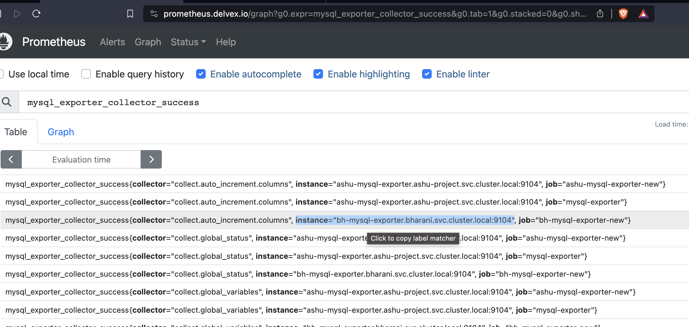
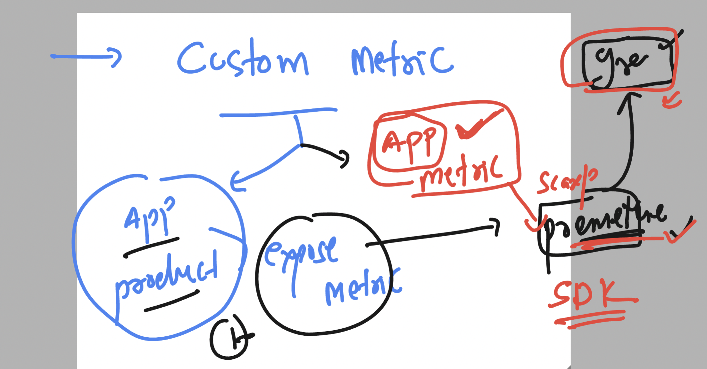
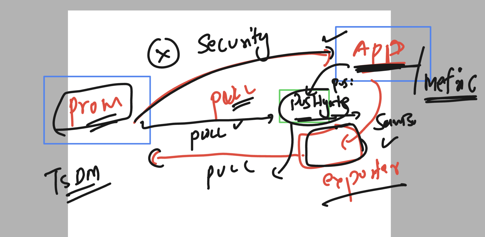

## Revision 



### checking connection for eks 

```
[ec2-user@vodafone ~]$ kubectl   get nodes
NAME                                            STATUS   ROLES    AGE   VERSION
ip-192-168-48-24.ap-south-1.compute.internal    Ready    <none>   18m   v1.25.13-eks-43840fb
ip-192-168-5-125.ap-south-1.compute.internal    Ready    <none>   18m   v1.25.13-eks-43840fb
ip-192-168-5-73.ap-south-1.compute.internal     Ready    <none>   20h   v1.25.13-eks-43840fb
ip-192-168-60-140.ap-south-1.compute.internal   Ready    <none>   12h   v1.25.13-eks-43840fb
[ec2-user@vodafone ~]$ 
[ec2-user@vodafone ~]$ kubectl  config get-contexts 
CURRENT   NAME                                                       CLUSTER                                                    AUTHINFO                                                   NAMESPACE
*         arn:aws:eks:ap-south-1:751136288263:cluster/vodafone-eks   arn:aws:eks:ap-south-1:751136288263:cluster/vodafone-eks   arn:aws:eks:ap-south-1:751136288263:cluster/vodafone-eks   ashu-project
[ec2-user@vodafone ~]$ 


```

### promethesu and grafana with Ingress controller 

```
[ec2-user@vodafone ~]$ kubectl  get all -n nginx-ingress-sample
[ec2-user@vodafone ~]$ kubectl  get all -n nginx-ingress-sample
NAME                                                     READY   STATUS    RESTARTS   AGE
pod/my-nginx-ingress-nginx-controller-8649966447-ts8gs   1/1     Running   0          12h

NAME                                                  TYPE           CLUSTER-IP      EXTERNAL-IP                                                                PORT(S)                      AGE
service/my-nginx-ingress-nginx-controller             LoadBalancer   10.100.12.252   a007dc21a36fd4131b54a0f746b3c6a7-1932653871.ap-south-1.elb.amazonaws.com   80:30831/TCP,443:30032/TCP   12h
service/my-nginx-ingress-nginx-controller-admission   ClusterIP      10.100.62.187   <none>                                                                     443/TCP                      12h
service/my-nginx-ingress-nginx-controller-metrics     ClusterIP      10.100.208.69   <none>                                                                     10254/TCP                    12h

NAME                                                READY   UP-TO-DATE   AVAILABLE   AGE
deployment.apps/my-nginx-ingress-nginx-controller   1/1     1            1           12h

NAME                                                           DESIRED   CURRENT   READY   AGE
replicaset.apps/my-nginx-ingress-nginx-controller-8649966447   1         1         1       12h
[ec2-user@vodafone ~]$ 
[ec2-user@vodafone ~]$ 
[ec2-user@vodafone ~]$ kubectl  get  ingress -n monitoring 
NAME              CLASS   HOSTS                  ADDRESS                                                                    PORTS   AGE
grafana-ingress   nginx   grafana.delvex.io      a007dc21a36fd4131b54a0f746b3c6a7-1932653871.ap-south-1.elb.amazonaws.com   80      12h
minimal-ingress   nginx   prometheus.delvex.io   a007dc21a36fd4131b54a0f746b3c6a7-1932653871.ap-south-1.elb.amazonaws.com   80      12h
[ec2-user@vodafone ~]$ kubectl  get  ingress grafana-ingress  -n monitoring -o yaml 
apiVersion: networking.k8s.io/v1
kind: Ingress
metadata:
  annotations:
    nginx.ingress.kubernetes.io/rewrite-target: /
  creationTimestamp: "2023-10-09T16:46:50Z"
  generation: 1
  name: grafana-ingress
  namespace: monitoring
  resourceVersion: "313375"
  uid: fd249c08-0e9c-4291-b6ef-f7ede9ecc184
spec:
  ingressClassName: nginx
  rules:
  - host: grafana.delvex.io
    http:
      paths:
      - backend:
          service:
            name: my-kube-prometheus-stack-grafana
            port:
              number: 80
        path: /
        pathType: Prefix
status:
  loadBalancer:
    ingress:
    - hostname: a007dc21a36fd4131b54a0f746b3c6a7-1932653871.ap-south-1.elb.amazonaws.com
```

### How to get user and password of grafana 

```
[ec2-user@vodafone ~]$ kubectl  get secret  -n monitoring 
NAME                                                              TYPE                 DATA   AGE
alertmanager-my-kube-prometheus-stack-alertmanager                Opaque               1      17h
alertmanager-my-kube-prometheus-stack-alertmanager-generated      Opaque               1      17h
alertmanager-my-kube-prometheus-stack-alertmanager-tls-assets-0   Opaque               0      17h
alertmanager-my-kube-prometheus-stack-alertmanager-web-config     Opaque               1      17h
my-kube-prometheus-stack-admission                                Opaque               3      17h
my-kube-prometheus-stack-grafana                                  Opaque               3      17h
my-kube-prometheus-stack-prometheus-scrape-confg                  Opaque               1      3h21m
prometheus-my-kube-prometheus-stack-prometheus                    Opaque               1      17h
prometheus-my-kube-prometheus-stack-prometheus-tls-assets-0       Opaque               1      17h
prometheus-my-kube-prometheus-stack-prometheus-web-config         Opaque               1      17h
sh.helm.release.v1.my-kube-prometheus-stack.v1                    helm.sh/release.v1   1      17h
sh.helm.release.v1.my-kube-prometheus-stack.v2                    helm.sh/release.v1   1      3h22m
[ec2-user@vodafone ~]$ kubectl  describe  secrets  my-kube-prometheus-stack-grafana  -n monitoring 
Name:         my-kube-prometheus-stack-grafana
Namespace:    monitoring
Labels:       app.kubernetes.io/instance=my-kube-prometheus-stack
              app.kubernetes.io/managed-by=Helm
              app.kubernetes.io/name=grafana
              app.kubernetes.io/version=10.1.4
              helm.sh/chart=grafana-6.60.3
Annotations:  meta.helm.sh/release-name: my-kube-prometheus-stack
              meta.helm.sh/release-namespace: monitoring

Type:  Opaque

Data
====
admin-user:      5 bytes
ldap-toml:       0 bytes
admin-password:  13 bytes

```

###  details below

```
[ec2-user@vodafone ~]$ kubectl  get   secrets  my-kube-prometheus-stack-grafana  -n monitoring  -o yaml 
apiVersion: v1
data:
  admin-password: cHJvbS1vcGVyYXRvcg==
  admin-user: YWRtaW4=
  ldap-toml: ""
kind: Secret
metadata:
  annotations:
    meta.helm.sh/release-name: my-kube-prometheus-stack
    meta.helm.sh/release-namespace: monitoring
  creationTimestamp: "2023-10-09T11:28:24Z"
  labels:
    app.kubernetes.io/instance: my-kube-prometheus-stack
    app.kubernetes.io/managed-by: Helm
    app.kubernetes.io/name: grafana
    app.kubernetes.io/version: 10.1.4
    helm.sh/chart: grafana-6.60.3
  name: my-kube-prometheus-stack-grafana
  namespace: monitoring
  resourceVersion: "148948"
  uid: 53481efa-8037-446f-b7a1-2b2337e73752
type: Opaque
[ec2-user@vodafone ~]$ echo "YWRtaW4="  | base64 -d
admin[ec2-user@vodafone ~]$ 
[ec2-user@vodafone ~]$ 
[ec2-user@vodafone ~]$ echo "cHJvbS1vcGVyYXRvcg=="  | base64 -d
prom-operator[ec2-user@vodafone ~]$ 

```


## MYSQL exporter -- done -- Deployment , cm ,service 

```
[ec2-user@vodafone mysql-exporter]$ kubectl  get  deploy
NAME                  READY   UP-TO-DATE   AVAILABLE   AGE
ashu-mysql-exporter   1/1     1            1           16h
ashu-mysqldb          1/1     1            1           17h
[ec2-user@vodafone mysql-exporter]$ kubectl   expose deployment ashu-mysql-exporter --type ClusterIP --port 9104 --dry-run=client -o yaml >svc.yaml 
[ec2-user@vodafone mysql-exporter]$ ls
cm.yaml  my.cnf  mysql_exporter.yaml  svc.yaml
[ec2-user@vodafone mysql-exporter]$ kubectl  apply -f svc.yaml 
service/ashu-mysql-exporter created
[ec2-user@vodafone mysql-exporter]$ kubectl  get  svc
NAME                  TYPE        CLUSTER-IP      EXTERNAL-IP   PORT(S)    AGE
ashu-db-svc           ClusterIP   10.100.142.27   <none>        3306/TCP   17h
ashu-mysql-exporter   ClusterIP   10.100.54.122   <none>        9104/TCP   3s
[ec2-user@vodafone mysql-exporter]$ 

```

## COncept of additional scapre for prometheus using HELm upgrade

### adding prometheus-scarpe change

```
[ec2-user@vodafone mysql-exporter]$ cat additional-scrape-helm.yaml 
prometheus:
  prometheusSpec:
    additionalScrapeConfigs:
     - job_name: 'ashu-mysql-exporter-new'
       scrape_interval: 5s
       static_configs:
        - targets: ['ashu-mysql-exporter.ashu-project.svc.cluster.local:9104']
     - job_name: 'bh-mysql-exporter-new'
       scrape_interval: 5s
       static_configs:
        - targets: ['bh-mysql-exporter.bharani.svc.cluster.local:9104']
```

### now we have to upgraade helm chart 

## step 1 

```
[ec2-user@vodafone mysql-exporter]$ helm repo ls -n monitoring 
NAME           	URL                                               
ashu-prometheus	https://prometheus-community.github.io/helm-charts
```

### step 2 

```
[ec2-user@vodafone mysql-exporter]$ helm  ls -n monitoring 
NAME                    	NAMESPACE 	REVISION	UPDATED                                	STATUS  	CHART                       	APP VERSION
my-kube-prometheus-stack	monitoring	3       	2023-10-10 05:42:14.914547054 +0000 UTC	deployed	kube-prometheus-stack-51.4.0	v0.68.0    
```

### step 3  

```
helm upgrade my-kube-prometheus-stack ashu-prometheus/kube-prometheus-stack --version 51.4.0  --values  additional-scrape-helm.yaml -n monitoring

===>> output expect

alse
Release "my-kube-prometheus-stack" has been upgraded. Happy Helming!
NAME: my-kube-prometheus-stack
LAST DEPLOYED: Tue Oct 10 05:42:14 2023
NAMESPACE: monitoring
STATUS: deployed
REVISION: 3
NOTES:
kube-prometheus-stack has been installed. Check its status by running:
  kubectl --namespace monitoring get pods -l "release=my-kube-prometheus-stack"

```

### checking on the prometheus query ui



### Custom metrics for promethes by sample APP



## Creating container of custom app with some inbuild metrics

```
git clone https://github.com/redashu/prom-custom-app.git
```

### building docker image for app 

```
[ec2-user@vodafone ashu-monitoring]$ ls
ashu-mysql-poc  docker-compose.yaml  prom-custom-app  prometheus.yml
[ec2-user@vodafone ashu-monitoring]$ 
[ec2-user@vodafone ashu-monitoring]$ mv prom-custom-app/ ashu-custom-app
[ec2-user@vodafone ashu-monitoring]$ ls
ashu-custom-app  ashu-mysql-poc  docker-compose.yaml  prometheus.yml
[ec2-user@vodafone ashu-monitoring]$ cd ashu-custom-app/
[ec2-user@vodafone ashu-custom-app]$ ls
Dockerfile  README.md  app.py  eks-deployment  requirements.txt
[ec2-user@vodafone ashu-custom-app]$ docker build  -t  ashu-python-customapp:version1 . 
Sending build context to Docker daemon  67.07kB
Step 1/6 : FROM python:3.9
3.9: Pulling from library/python
167b8a53ca45: Already exists 
b47a222d28fa: Already exists 
debce5f9f3a9: Pull complete 
1d7ca7cd2e06: Pull complete 
ff3119008f58: Extracting [======================>                            ]  2.818MB/6.389MB
88
```

### verify image name 

```
[ec2-user@vodafone ashu-custom-app]$ docker images
REPOSITORY              TAG        IMAGE ID       CREATED          SIZE
rg-custom-metric-app    v1         cf2aa25de4d4   7 seconds ago    1.01GB
np-custom-app           v1         280eedad1c74   23 seconds ago   1.01GB
ashu-python-customapp   version1   7a3121a12a60   23 seconds ago   1.01GB
bharani_prom            v1         0a538b80eedb   23 seconds ago   1.01GB

```


### lets deploy into EKS 

```
kubectl  create  deployment ashu-custom-app --image=docker.io/dockerashu/voda-prome-customapp:v1 --port 5000 --dry-run=client -o yaml >deployment.yaml
```

### checking 

```
[ec2-user@vodafone ashu-custom-app]$ kubectl  apply -f deployment.yaml 
deployment.apps/ashu-custom-app created
[ec2-user@vodafone ashu-custom-app]$ kubectl  get deploy
NAME                  READY   UP-TO-DATE   AVAILABLE   AGE
ashu-custom-app       0/1     1            0           4s
ashu-mysql-exporter   1/1     1            1           18h
ashu-mysqldb          1/1     1            1           19h
[ec2-user@vodafone ashu-custom-app]$ kubectl  get deploy
NAME                  READY   UP-TO-DATE   AVAILABLE   AGE
ashu-custom-app       1/1     1            1           41s
```

### expose app using service 

```
kubectl  get  deploy 
NAME                  READY   UP-TO-DATE   AVAILABLE   AGE
ashu-custom-app       1/1     1            1           74s
ashu-mysql-exporter   1/1     1            1           18h
ashu-mysqldb          1/1     1            1           19h
[ec2-user@vodafone ashu-custom-app]$ kubectl  expose deployment ashu-custom-app --type ClusterIP --port 5000 --dry-run=client -o yaml >svc.yaml 
[ec2-user@vodafone ashu-custom-app]$ kubectl  apply -f svc.yaml 
service/ashu-custom-app created
[ec2-user@vodafone ashu-custom-app]$ kubectl  get svc
NAME                  TYPE        CLUSTER-IP       EXTERNAL-IP   PORT(S)    AGE
ashu-custom-app       ClusterIP   10.100.253.118   <none>        5000/TCP   3s
ashu-db-svc           ClusterIP   10.100.142.27    <none>        3306/TCP   19h
ashu-mysql-exporter   ClusterIP   10.100.54.122    <none>        9104/TCP   104m
```

### to access this app by end users i need to create Ingress routing rule 

```
[ec2-user@vodafone ashu-custom-app]$ cat ingress.yaml 
apiVersion: networking.k8s.io/v1
kind: Ingress
metadata:
  name: ashu-custom-ingress
  annotations:
    nginx.ingress.kubernetes.io/rewrite-target: /
spec:
  rules:
  - host: test-voda.delvex.io
    http:
      paths:
      - path: /
        pathType: Prefix
        backend:
          service:
            name: ashu-custom-app
            port:
              number: 5000

[ec2-user@vodafone ashu-custom-app]$ kubectl  create -f ingress.yaml 
ingress.networking.k8s.io/ashu-custom-ingress created
[ec2-user@vodafone ashu-custom-app]$ 
[ec2-user@vodafone ashu-custom-app]$ kubectl  get ingress
NAME                  CLASS    HOSTS                 ADDRESS   PORTS   AGE
ashu-custom-ingress   <none>   test-voda.delvex.io             80      6s
[ec2-user@vodafone ashu-custom-app]$ 

```

### adding additional scrape

```
[ec2-user@vodafone mysql-exporter]$ cat additional-scrape-helm.yaml 
prometheus:
  prometheusSpec:
    additionalScrapeConfigs:
     - job_name: 'ashu-mysql-exporter-new'
       scrape_interval: 5s
       static_configs:
        - targets: ['ashu-mysql-exporter.ashu-project.svc.cluster.local:9104']
     - job_name: 'bh-mysql-exporter-new'
       scrape_interval: 5s
       static_configs:
        - targets: ['bh-mysql-exporter.bharani.svc.cluster.local:9104']
     - job_name: 'ashu-custom-app'
       scrape_interval: 5s
       static_configs:
        - targets: ['ashu-custom-app.ashu-project.svc.cluster.local:5000']
     - job_name: 'rg-custom-app'
       scrape_interval: 5s
       static_configs:
        - targets: ['rg-custom-app.rgodiyal.svc.cluster.local:5000']
```

### upgrading helm 

```
[ec2-user@vodafone mysql-exporter]$ ls
additional-scrape-helm.yaml  cm.yaml  my.cnf  mysql_exporter.yaml  svc.yaml
[ec2-user@vodafone mysql-exporter]$ 
[ec2-user@vodafone mysql-exporter]$ helm repo ls -n monitoring 
NAME           	URL                                               
ashu-prometheus	https://prometheus-community.github.io/helm-charts
[ec2-user@vodafone mysql-exporter]$ 
[ec2-user@vodafone mysql-exporter]$ 
[ec2-user@vodafone mysql-exporter]$ helm ls -n monitoring 
NAME                    	NAMESPACE 	REVISION	UPDATED                                	STATUS  	CHART                       	APP VERSION
my-kube-prometheus-stack	monitoring	5       	2023-10-10 05:51:35.655712658 +0000 UTC	deployed	kube-prometheus-stack-51.4.0	v0.68.0    
[ec2-user@vodafone mysql-exporter]$ 
[ec2-user@vodafone mysql-exporter]$ helm upgrade my-kube-prometheus-stack   ashu-prometheus/kube-prometheus-stack --version 51.4.0 --values  additional-scrape-helm.yaml  -n monitoring 
false

```

### sending some http request internally 

```
ec2-user@vodafone mysql-exporter]$ kubectl  get  svc
NAME                  TYPE        CLUSTER-IP       EXTERNAL-IP   PORT(S)    AGE
ashu-custom-app       ClusterIP   10.100.253.118   <none>        5000/TCP   20m
ashu-db-svc           ClusterIP   10.100.142.27    <none>        3306/TCP   19h
ashu-mysql-exporter   ClusterIP   10.100.54.122    <none>        9104/TCP   124m
[ec2-user@vodafone mysql-exporter]$ 
[ec2-user@vodafone mysql-exporter]$ 
[ec2-user@vodafone mysql-exporter]$ kubectl  run  attack --rm -it --image=alpine --command sh 


If you don't see a command prompt, try pressing enter.

/ # 
/ # 
/ # apk add curl &>/dev/null
/ # curl http://ashu-custom-app.ashu-project.svc.cluster.local:5000 
Welcome to Custom Metrics Application/ # 
/ # 
/ # curl http://ashu-custom-app.ashu-project.svc.cluster.local:5000/records 
<!doctype html>
<html lang=en>
<title>404 Not Found</title>
<h1>Not Found</h1>
<p>The requested URL was not found on the server. If you entered the URL manually please check your spelling and try again.</p>
/ # curl http://ashu-custom-app.ashu-project.svc.cluster.local:5000/record
Metric recorded: Request count incremented/ # 
/ # 

```

### custom app -- addintiona scrape 

```
[ec2-user@vodafone mysql-exporter]$ cat  additional-scrape-helm.yaml 
prometheus:
  prometheusSpec:
    additionalScrapeConfigs:
     - job_name: 'ashu-mysql-exporter-new'
       scrape_interval: 5s
       static_configs:
        - targets: ['ashu-mysql-exporter.ashu-project.svc.cluster.local:9104']
     - job_name: 'bh-mysql-exporter-new'
       scrape_interval: 5s
       static_configs:
        - targets: ['bh-mysql-exporter.bharani.svc.cluster.local:9104']
     - job_name: 'ashu-custom-app'
       scrape_interval: 5s
       static_configs:
        - targets: ['ashu-custom-app.ashu-project.svc.cluster.local:5000']
     - job_name: 'rg-custom-app'
       scrape_interval: 5s
       static_configs:
        - targets: ['rg-custom-app.rgodiyal.svc.cluster.local:5000']
```

### helm upgrade command 

```
 helm upgrade my-kube-prometheus-stack   ashu-prometheus/kube-prometheus-stack --version 51.4.0 --values  additional-scrape-helm.yaml  -n monitoring 
```
## Pushgateway understanding 




