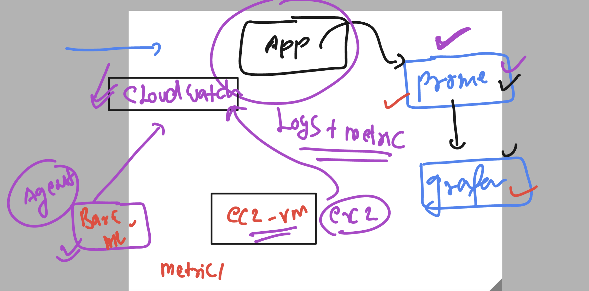
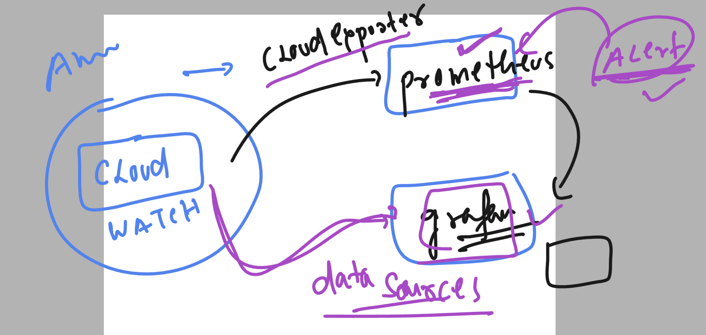

### Revision 

### technical 

```
[ec2-user@vodafone ~]$ helm ls -n monitoring 
NAME                    	NAMESPACE 	REVISION	UPDATED                                	STATUS  	CHART                       	APP VERSION
my-kube-prometheus-stack	monitoring	20      	2023-10-10 12:54:19.770808127 +0000 UTC	failed  	kube-prometheus-stack-51.4.0	v0.68.0    
prometheus-vodafone     	monitoring	4       	2023-10-10 12:32:23.000195469 +0000 UTC	deployed	prometheus-msteams-1.3.4    	v1.5.2     
[ec2-user@vodafone ~]$ kubectl   get  po -n monitoring 
NAME                                                           READY   STATUS      RESTARTS   AGE
alertmanager-my-kube-prometheus-stack-alertmanager-0           2/2     Running     0          16h
my-kube-prometheus-stack-admission-create-qsmh8                0/1     Completed   0          15h
my-kube-prometheus-stack-grafana-b5bc54dd6-xbxl2               3/3     Running     0          15h
my-kube-prometheus-stack-kube-state-metrics-647554675d-jpf52   1/1     Running     0          15h
my-kube-prometheus-stack-operator-7bf78c6bb9-kcgkf             1/1     Running     0          16h
my-kube-prometheus-stack-prometheus-node-exporter-87jb7        1/1     Running     0          114m
my-kube-prometheus-stack-prometheus-node-exporter-fxhlx        1/1     Running     0          114m
my-kube-prometheus-stack-prometheus-node-exporter-k9vf8        1/1     Running     0          149m
my-kube-prometheus-stack-prometheus-node-exporter-rr5qq        1/1     Running     0          149m
prometheus-msteams-6749f49647-jqcsn                            1/1     Running     0          16h
prometheus-my-kube-prometheus-stack-prometheus-0               2/2     Running     0          16h
[ec2-user@vodafone ~]$ kubectl   get  svc -n monitoring
NAME                                                TYPE        CLUSTER-IP       EXTERNAL-IP   PORT(S)                      AGE
alertmanager-operated                               ClusterIP   None             <none>        9093/TCP,9094/TCP,9094/UDP   41h
my-kube-prometheus-stack-alertmanager               ClusterIP   10.100.189.13    <none>        9093/TCP,8080/TCP            41h
my-kube-prometheus-stack-grafana                    ClusterIP   10.100.121.21    <none>        80/TCP                       41h
my-kube-prometheus-stack-kube-state-metrics         ClusterIP   10.100.83.127    <none>        8080/TCP                     41h
my-kube-prometheus-stack-operator                   ClusterIP   10.100.95.254    <none>        443/TCP                      41h
my-kube-prometheus-stack-prometheus                 ClusterIP   10.100.105.248   <none>        9090/TCP,8080/TCP            41h
my-kube-prometheus-stack-prometheus-node-exporter   ClusterIP   10.100.165.14    <none>        9100/TCP                     41h
prometheus-msteams                                  ClusterIP   10.100.197.125   <none>        2000/TCP                     17h
prometheus-operated                                 ClusterIP   None             <none>        9090/TCP                     41h
[ec2-user@vodafone ~]$ 
[ec2-user@vodafone ~]$ kubectl  get ep -n monitoring 
NAME                                                ENDPOINTS                                                                AGE
alertmanager-operated                               192.168.31.120:9094,192.168.31.120:9094,192.168.31.120:9093              41h
my-kube-prometheus-stack-alertmanager               192.168.31.120:8080,192.168.31.120:9093                                  41h
my-kube-prometheus-stack-grafana                    192.168.40.131:3000                                                      41h
my-kube-prometheus-stack-kube-state-metrics         192.168.42.3:8080                                                        41h
my-kube-prometheus-stack-operator                   192.168.23.189:10250                                                     41h
my-kube-prometheus-stack-prometheus                 192.168.28.90:9090,192.168.28.90:8080                                    41h
my-kube-prometheus-stack-prometheus-node-exporter   192.168.19.93:9100,192.168.30.100:9100,192.168.40.130:9100 + 1 more...   41h
prometheus-msteams                                  192.168.28.28:2000                                                       17h
prometheus-operated                                 192.168.28.90:9090                                                       41h
[ec2-user@vodafone ~]$ kubectl  get  ing -n monitoring 
NAME              CLASS   HOSTS                  ADDRESS                                                                    PORTS   AGE
alert-route       nginx   alert.delvex.io        a007dc21a36fd4131b54a0f746b3c6a7-1674775037.ap-south-1.elb.amazonaws.com   80      19h
grafana-ingress   nginx   grafana.delvex.io      a007dc21a36fd4131b54a0f746b3c6a7-1674775037.ap-south-1.elb.amazonaws.com   80      36h
minimal-ingress   nginx   prometheus.delvex.io   a007dc21a36fd4131b54a0f746b3c6a7-1674775037.ap-south-1.elb.amazonaws.com   80      36h
```


### CRD in k8s after deployment of Helm based prometheus stack 

```
[ec2-user@vodafone mongo-db-webapp]$ kubectl  api-resources   | grep -i monitor
alertmanagerconfigs               amcfg        monitoring.coreos.com/v1alpha1         true         AlertmanagerConfig
alertmanagers                     am           monitoring.coreos.com/v1               true         Alertmanager
podmonitors                       pmon         monitoring.coreos.com/v1               true         PodMonitor
probes                            prb          monitoring.coreos.com/v1               true         Probe
prometheusagents                  promagent    monitoring.coreos.com/v1alpha1         true         PrometheusAgent
prometheuses                      prom         monitoring.coreos.com/v1               true         Prometheus
prometheusrules                   promrule     monitoring.coreos.com/v1               true         PrometheusRule
scrapeconfigs                     scfg         monitoring.coreos.com/v1alpha1         true         ScrapeConfig
servicemonitors                   smon         monitoring.coreos.com/v1               true         ServiceMonitor
thanosrulers                      ruler        monitoring.coreos.com/v1               true         ThanosRuler
```

### scarpe config 

```
apiVersion: monitoring.coreos.com/v1alpha1
kind: ScrapeConfig
metadata:
  name: ashuapp-scrape-config 
  namespace: monitoring # where prometheus got deployed
  labels:
    release: prom-stack
spec:
  staticConfigs:
    - labels:
        job: ashu-mongodb-exporter
      targets:
        - mongodb-exporter.ashu-project.svc.cluster.local:9216
    - labels:
        job: ashu-nginx-exporter
      targets:
        - nginx-exporter.ashu-project.svc.cluster.local:9113
```

### deploy it

```
[ec2-user@vodafone mongo-db-webapp]$ kubectl  get scrapeconfigs.monitoring.coreos.com -n monitoring 
NAME                    AGE
ashuapp-scrape-config   3m49s
```


### prom rule 

```
apiVersion: monitoring.coreos.com/v1
kind: PrometheusRule
metadata:
  creationTimestamp: null
  labels:
    release: my-kube-prometheus-stack
  name: ashu-flask-alert-rules
  namespace: monitoring
spec:
    groups:
    - name: ashu-flask-rule1
      rules:
      - alert: AshuFlaskAppDeloymentReplicasMismatch
        expr: kube_deployment_spec_replicas{namespace="ashu-project", deployment="dashboard"} != kube_deployment_status_replicas_available{namespace="ashu-project", deployment="dashboard"}
        for: 1m
        labels:
          severity: warning
        annotations:
          summary: "Deployment {{ $labels.deployment }} in namespace {{ $labels.namespace }} has a replicas mismatch"
          description: "The replicas for Deployment {{ $labels.deployment }} in namespace {{ $labels.namespace }} do not match for more than 1 minutes."

```

### Metrics and log collection with cloudwatch 



### cloudwatch agent config detail

```
[root@ip-172-31-40-145 ~]# 
[root@ip-172-31-40-145 ~]# 
[root@ip-172-31-40-145 ~]# cd  /opt/aws/amazon-cloudwatch-agent/
[root@ip-172-31-40-145 amazon-cloudwatch-agent]# ls
LICENSE  NOTICE  RELEASE_NOTES  THIRD-PARTY-LICENSES  bin  doc  etc  logs  var
[root@ip-172-31-40-145 amazon-cloudwatch-agent]# ls bin/
CWAGENT_VERSION          amazon-cloudwatch-agent-config-wizard  config-downloader  config.json      start-amazon-cloudwatch-agent
amazon-cloudwatch-agent  amazon-cloudwatch-agent-ctl            config-translator  config.json.bak
[root@ip-172-31-40-145 amazon-cloudwatch-agent]# 


```

### cloudwatch to prometheus and grafana




