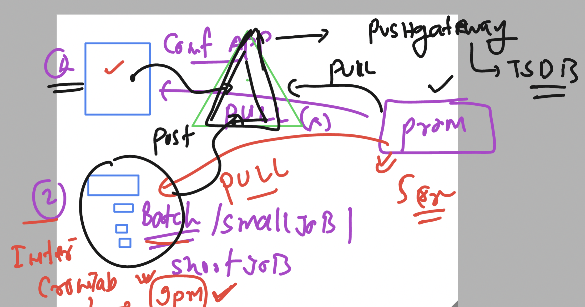
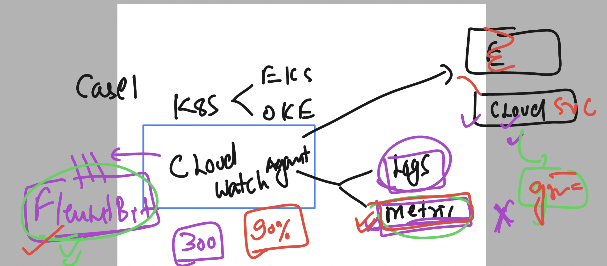

## REvsion 


### EKS -- Prometheus status 

```
[ec2-user@vodafone ~]$ kubectl  get  po -n monitoring 
NAME                                                           READY   STATUS    RESTARTS   AGE
alertmanager-my-kube-prometheus-stack-alertmanager-0           2/2     Running   0          8h
my-kube-prometheus-stack-grafana-b5bc54dd6-f9fvc               3/3     Running   0          8h
my-kube-prometheus-stack-kube-state-metrics-647554675d-z2wlb   1/1     Running   0          8h
my-kube-prometheus-stack-operator-7bf78c6bb9-c8xjs             1/1     Running   0          8h
my-kube-prometheus-stack-prometheus-node-exporter-4fx2w        1/1     Running   0          20m
my-kube-prometheus-stack-prometheus-node-exporter-52b7c        1/1     Running   0          20m
my-kube-prometheus-stack-prometheus-node-exporter-6ntks        1/1     Running   0          20m
my-kube-prometheus-stack-prometheus-node-exporter-bsr8m        1/1     Running   0          20m
my-kube-prometheus-stack-prometheus-node-exporter-t8ttk        1/1     Running   0          20m
prometheus-msteams-6749f49647-ckl2q                            1/1     Running   0          8h
prometheus-my-kube-prometheus-stack-prometheus-0               2/2     Running   0          8h
[ec2-user@vodafone ~]$ 
[ec2-user@vodafone ~]$ kubectl  get  svc  -n monitoring 
NAME                                                TYPE        CLUSTER-IP       EXTERNAL-IP   PORT(S)                      AGE
alertmanager-operated                               ClusterIP   None             <none>        9093/TCP,9094/TCP,9094/UDP   2d17h
my-kube-prometheus-stack-alertmanager               ClusterIP   10.100.189.13    <none>        9093/TCP,8080/TCP            2d17h
my-kube-prometheus-stack-grafana                    ClusterIP   10.100.121.21    <none>        80/TCP                       2d17h
my-kube-prometheus-stack-kube-state-metrics         ClusterIP   10.100.83.127    <none>        8080/TCP                     2d17h
my-kube-prometheus-stack-operator                   ClusterIP   10.100.95.254    <none>        443/TCP                      2d17h
my-kube-prometheus-stack-prometheus                 ClusterIP   10.100.105.248   <none>        9090/TCP,8080/TCP            2d17h
my-kube-prometheus-stack-prometheus-node-exporter   ClusterIP   10.100.165.14    <none>        9100/TCP                     2d17h
prometheus-msteams                                  ClusterIP   10.100.197.125   <none>        2000/TCP                     41h
prometheus-operated                                 ClusterIP   None             <none>        9090/TCP                     2d17h
[ec2-user@vodafone ~]$ 

```

## Introduction pushgateway 



### pushgateway install

```
[ec2-user@vodafone ~]$ helm repo ls
NAME              	URL                                                     
ashu-prometheus   	https://prometheus-community.github.io/helm-charts      
prometheus-msteams	https://prometheus-msteams.github.io/prometheus-msteams/
[ec2-user@vodafone ~]$ helm install my-prometheus-pushgateway ashu-prometheus/prometheus-pushgateway --version 2.4.1 -n monitoring 
NAME: my-prometheus-pushgateway
LAST DEPLOYED: Thu Oct 12 05:21:46 2023
NAMESPACE: monitoring
STATUS: deployed
REVISION: 1
TEST SUITE: None
NOTES:
1. Get the application URL by running these commands:
  export POD_NAME=$(kubectl get pods --namespace monitoring -l "app=prometheus-pushgateway,release=my-prometheus-pushgateway" -o jsonpath="{.items[0].metadata.name}")

```

### sending data to pushgw using curl 

```
echo 'voda_metrics 42' | curl --data-binary @- http://localhost:1155/metrics/job/okgoogle/instance/192.168.99.200\n
```

### python script also 

```
from prometheus_client import CollectorRegistry, Gauge, push_to_gateway, pushadd_to_gateway

# Sample metric data
metric_name = "my_metric"
metric_value = 42

# Job name and instance
job_name = "my_job"
instance = "my_instance"

# Prometheus Pushgateway URL
pushgateway_url = "http://pushgateway:9091"

# Create a registry
registry = CollectorRegistry()

# Create a Gauge metric
metric = Gauge(metric_name, 'Description of gauge', labelnames=['job', 'instance'], registry=registry)

# Set the metric value
metric.labels(job=job_name, instance=instance).set(metric_value)

# Push the metric to Prometheus Pushgateway
# Use push_to_gateway if you want to replace existing metrics for the job and instance
# Use pushadd_to_gateway if you want to add new metrics to existing metrics for the job and instance
push_to_gateway(pushgateway_url, job=job_name, registry=registry, grouping_key={'instance': instance})

```

### FluentBit and FluentD


### fluentbit - cloudwatch -- grafana 



### FLuentBit final


### CLoudwatch case 


