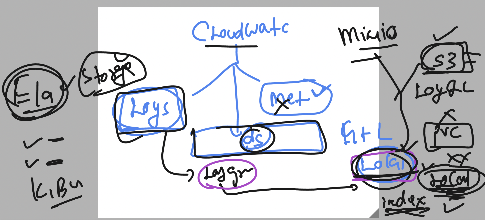
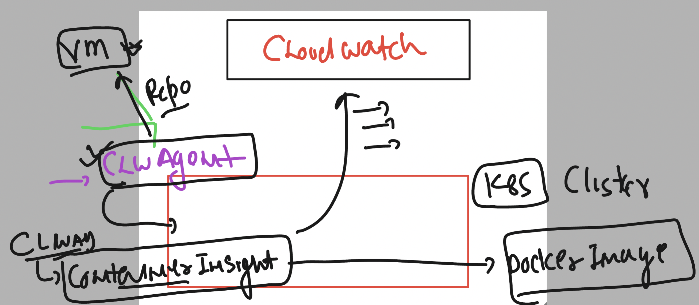
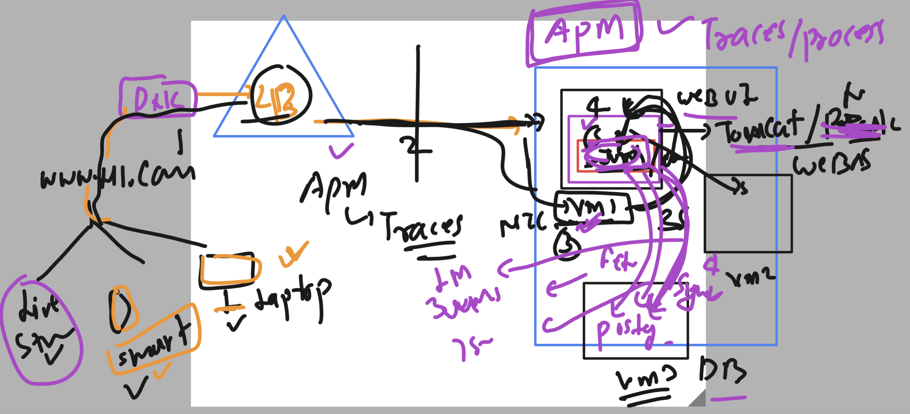

### Revision 

### Grafana Loki



### Cloudwatch -- Internal agent to k8s stack monitoring -- COntainerInsight 



### APM -- Traces 



### vodafone case 


### app curl request 

```
 curl -X GET  http://43.204.182.9:8080/notes
curl -X POST  http://43.204.182.9:8080/notes?desc=vodafone  # note : desc is variable and vodafone is values 
```
